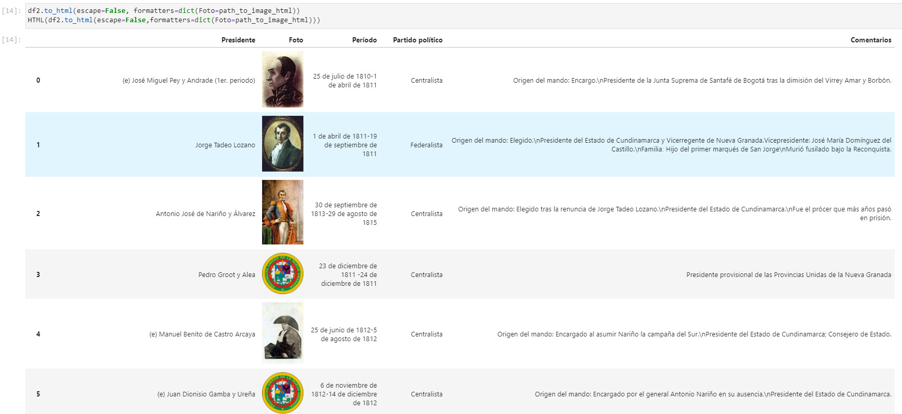

Big Data Analytics.
 
Universidad el bosque.
 
Nombre: Carlos Niño.
 
Profesor: Fabian Peña.
  
Examen 2

:pushpin: El archivo de Jupyter-lab se encuentra en la carpeta: <a href="./Examen2/Examen2.ipynb">Examen2/Examen2.ipynb</a>

Nota: El archivo .ipynb si se abre directamente desde github o el exportado de HTML no está cargando las imágenes, pero anexo la evidencia de que si se cargan las imágenes desde Jupyter-lab.

Parte inicial de la tabla:

Parte final de la tabla:

